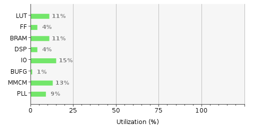
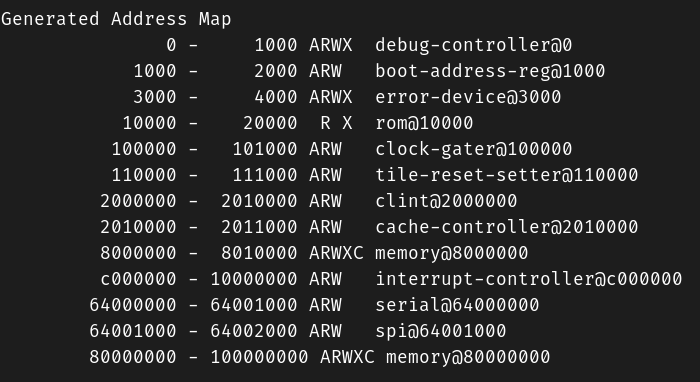
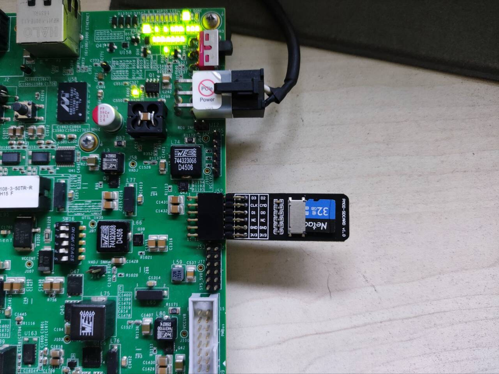
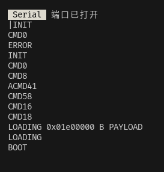
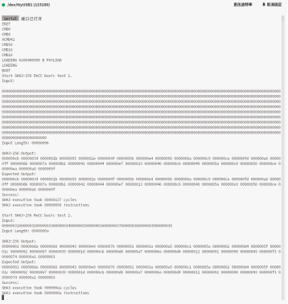
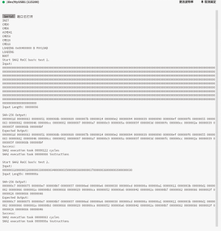

# 基于RISC-V的SHA系列哈希算法硬件加速器

关键词：SHA、Rocket Chip、Chipyard、RoCC、FPGA

<br/>

English version [is here](readme_en.md)

<br/>

本项目相关的仓库：

[本仓库](https://github.com/BriMonzZY/sha-acc)

[运行本项目的chipyard环境](https://github.com/BriMonzZY/chipyard-shaacc) ( fork自chipyard v1.11.0 )

[支持本项目sha扩展的spike](https://github.com/BriMonzZY/riscv-isa-sim-sha-extension) ( fork自riscv-isa-sim v1.1.0 )

[支持VCU108的fpga-shell](https://github.com/BriMonzZY/rocket-chip-fpga-shells) ( fork自rocket-chip-fpga-shells )

<br/>

<br/>

文件结构：

```txt
.
├── sha3sim // SHA3算法的C语言实现
├── sha3acc // SHA3算法硬件加速器
|   ├── software
|   └── src
├── sha2sim // SHA2算法的C语言实现
├── sha2acc // SHA2算法硬件加速器
|   ├── software
|   └── src
└── doc // 文档
```

<br/>

<br/>

## 仿真

使用方式：

本项目需要在配套的 [chipyard-shaacc](https://github.com/BriMonzZY/chipyard-shaacc) 环境中运行：

```shell
git clone https://github.com/BriMonzZY/chipyard-shaacc.git

cd chipyard-shaacc

# 这一步可能需要较长的时间，需要占用 >3GB 的存储空间，建议科学上网，并且到网络环境较好的位置，否则可能会初始化失败
./init_env.sh # 初始化chipyard环境
```

<br/>

项目代码在 `chipyard-shaacc/generators/sha-acc` 目录中。

可以执行 `build.sh` 、`chiseltest.sh` 或者 `run.sh` 脚本来编译或者运行本项目：

```shell
## 进入目录
cd chipyard-shaacc/generators/sha-acc

## help
./build.sh -h 
./run.sh -h
./fpgabuild.sh -h
./chiseltest.sh -h


./build.sh sha3acc
./build.sh sha3accprint

./build.sh sha2acc
./build.sh sha2accprint

./build.sh test # 编译测试程序

./build.sh clean # 在sims/verilator和sims/vcs和sims/xcelium中执行 make clean 清除编译产生的文件


./run.sh # 运行编译的文件或者编译并运行(TODO还没有完善)


## 运行单元测试
./chiseltest.sh
./chiseltest.sh sha3
./chiseltest.sh sha2
```

<br/>

<br/>

## FPGA原型验证

### 生成FPGA比特流文件

默认生成适用于 [Xilinx VCU108](https://china.xilinx.com/products/boards-and-kits/ek-u1-vcu108-g.html) 板卡的比特流文件

脚本文件先检查是否有Vivado工具的环境变量,请确认安装了Vivado工具

```shell
./fpgabuild.sh -h # 获取帮助
```

bitstream 生成成功后可以在 `fpga/generated-src/<long-name>/obj` 中找到比特流文件以及 vivado 的检查点文件，可以查看资源利用率以及时序报告等信息，或者在 checkpoint 上根据 [UltraFast](https://docs.amd.com/r/zh-CN/ug949-vivado-design-methodology) 流程插入ILA探针进行调试。

<br/>

在VCU108板卡**XCVU095-2FFVA2104E**下进行综合：

 

在 4.16ns 的时序约束下，关键路径的建立时间的裕量为 1.075ns

<br/>

<br/>

### 运行裸机 ( bare-metal ) 程序

chipyard通过固化在ROM的**sdboot**程序来从SD卡中加载用户程序

例如我生成一个默认配置的Rocket Core的比特流文件,处理器核的pc将从0x10000开始运行（也就是存放sdboot的ROM的位置），sdboot开始通过SPI协议将SD卡对应位置（34）的程序拷贝到0x80000000开始的内存位置上，随后设置寄存器以及运行其他必要操作（设置a0和a1用于启动Linux）然后跳转到0x80000000地址开始执行程序。

sdboot的代码在`fpga/src/main/resources/vcu118/sdboot`位置

<br/>

Chipyard生成的SoC的地址映射关系：

 

<br/>

#### VCU108的Micro-SD外设

板载的SD卡卡槽是连接在ZYNQ7010上的，只能用于板卡的配置，所以需要外接一个SD卡卡槽用于插入SD卡

我使用了PMOD模块连接在VCU108右侧的PMOD接口上，如下图所示

 

<br/>

#### 将裸机程序加载进Micro-SD卡

大致流程：将用户程序编译完成后,用objcopy工具生成bin文件，然后用dd指令加载进SD卡

<br/>

成功加载SD卡将会输出如下的内容:

 

<br/>

<br/>

初始化SD卡：

可以参考 [Chipyard 文档](https://chipyard.readthedocs.io/en/1.11.0/Prototyping/VCU118.html#setting-up-the-sdcard)

先用`sudo fdisk -l`命令寻找SD卡，下面以SD卡在 /dev/sda 位置为例

1. 使用gdisk工具`sudo gdisk /dev/sda`，用x命令进入expert模式，输入z命令来格式化SD卡
2. 重新进入gdisk工具，输入o命令创建新的GPT
3. 进入expert模式，输入l命令然后输入1，将默认的对齐设置为1
4. 输入m命令推出expert模式，输入n命令来创建第一个分区：partion number 1 ; select sector 34 ; size +1048576 ; type *apfs*
5. **输入w指令保存更改并写入**
6. （可以不创建第二个分区sda2）

这样我们就创建了一个512MiB的 `/dev/sda1` ，我们将把bin文件烧录到这个分区

<br/>

以sha3-sw.bin为例，输入如下指令：

```shell
sudo dd if=sha3-sw/bin of=/dev/sda1
```

等待写入完成后就可以将SD卡插入FPGA板卡了。

<br/>

#### 测试结果

在FPGA上运行SHA3测试：

 

<br/>

运行SHA2测试：

 


